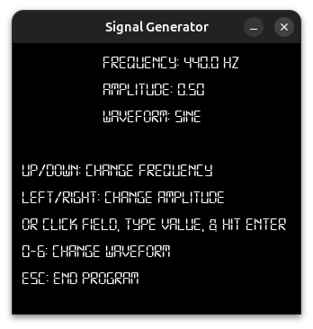

# sig_gen
I built this to test my current project fully and figured it might help out anyone looking for a good, cheap, and minimalist way to test any audio analysis tools or audio device output.

sig_gen is an audio signal generator with a minimal graphical interface, built with C and SDL2. 





## Features
- **7 waveform types:** Sine, Square, Saw, Triangle, White Noise, Pink Noise, and silence
- **Real-time parameter control** via keyboard or by clicking and typing values directly
- **Smooth parameter transitions** — all parameter changes are interpolated to avoid clicks and pops
- **Embedded font** — no external font files needed at runtime
  
## Controls
| Input | Action |
|---|---|
| `↑` / `↓` | Increase / decrease frequency by 10 Hz |
| `←` / `→` | Decrease / increase amplitude by 0.05 |
| `0` | Silence |
| `1` | Sine wave |
| `2` | Square wave |
| `3` | Sawtooth wave |
| `4` | Triangle wave |
| `5` | White noise |
| `6` | Pink noise |
| `ESC` | Quit |
You can also **click** on the Frequency or Amplitude fields, **type** a value, and press **Enter** to set it directly. Valid ranges are 20–20000 Hz for frequency and 0.0–1.0 for amplitude.

## Building
### Dependencies
| Platform | Requirements |
|---|---|
| **Linux** | `cmake`, a C compiler, `SDL2-dev`, `SDL2-ttf-dev` |
| **macOS** | Xcode command line tools, `cmake`, `SDL2`, `SDL2_ttf` |
| **Windows** | `cmake`, a C compiler, SDL2 and SDL2_ttf dev libraries |
### Build & Run
```sh
cmake -B build -DCMAKE_BUILD_TYPE=Release
cmake --build build
./build/sig_gen
```

## Switching Fonts
The font is compiled directly into the binary. To use a different `.ttf` font:
```sh
xxd -i yourfont.ttf > font_embedded.c
```
Then update the variable names in `font_embedded.c` to match the `extern` declarations at the top of `renderer.c`, and make sure both arrays are declared `const`.

## License
MIT

> **Note:** The embedded font, Digital-7 by Sizenko Alexander ([Style-7](http://www.styleseven.com)), is freeware for personal and educational use. It is **not** covered by the MIT license. For commercial use, a separate license must be purchased from the author or you must use the steps above to switch to a different font that allows for commercial use.

## Authors
**Cody Wiggins**
- Website: [codywigginsdev.neocities.org](https://codywigginsdev.neocities.org)
- Email: [codywigginsdev@gmail.com](mailto:codywigginsdev@gmail.com)

**Digital-7 Font** — Sizenko Alexander / Style-7
- [http://www.styleseven.com](http://www.styleseven.com)
